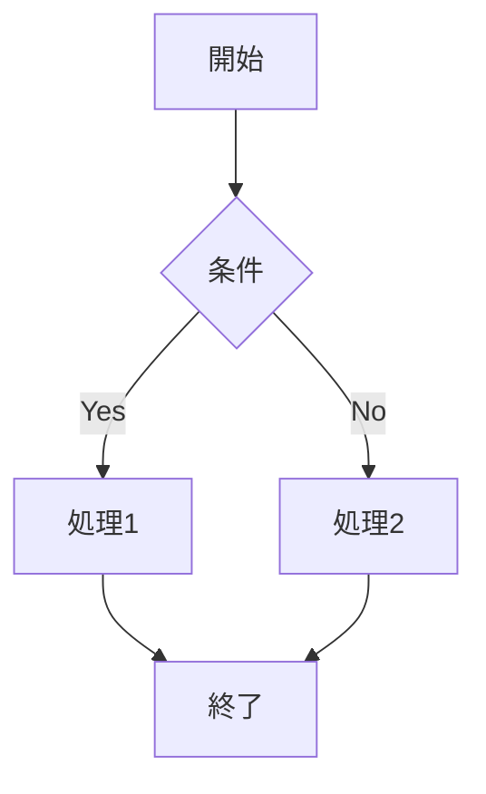

# 機能仕様

MarkDrive の各機能について詳しく説明します。

## Markdown レンダリング

### GitHub Flavored Markdown (GFM)

標準の Markdown 構文に加え、GitHub Flavored Markdown をサポートしています。

#### テーブル

```markdown
| 列1 | 列2 | 列3 |
|-----|-----|-----|
| A   | B   | C   |
| D   | E   | F   |
```

#### タスクリスト

```markdown
- [x] 完了したタスク
- [ ] 未完了のタスク
```

#### 打ち消し線

```markdown
~~打ち消し線~~
```

#### オートリンク

URL やメールアドレスは自動的にリンクになります。

### シンタックスハイライト

コードブロックは言語を指定することでシンタックスハイライトが適用されます。

````markdown
```javascript
const greeting = "Hello, World!";
console.log(greeting);
```
````

**対応言語例:**
- JavaScript / TypeScript
- Python
- Go
- Rust
- Java
- C / C++
- HTML / CSS
- JSON / YAML
- Markdown
- その他多数

### Mermaid ダイアグラム

コードブロックで `mermaid` を指定すると、ダイアグラムとしてレンダリングされます。

````markdown

````

**対応ダイアグラム:**
- フローチャート（flowchart）
- シーケンス図（sequenceDiagram）
- クラス図（classDiagram）
- 状態遷移図（stateDiagram）
- ER 図（erDiagram）
- ガントチャート（gantt）
- パイチャート（pie）
- その他

---

## Google Drive 連携

### 認証

Google OAuth 2.0 を使用した安全な認証を提供します。

- **スコープ**: `drive.readonly`（読み取り専用）
- **認証方式**: ポップアップウィンドウ
- **セッション**: ブラウザを閉じるまで有効

### ファイル検索

- **検索対象**: Markdown ファイル（`.md`）のみ
- **検索範囲**: アクセス可能なすべての Google Drive ファイル
- **最小文字数**: 2文字以上
- **結果件数**: 最大20件

### キーボードショートカット

| ショートカット | 動作 |
|---------------|------|
| `⌘K` / `Ctrl+K` | 検索画面を開く |
| `Escape` | 検索画面を閉じる |

---

## ローカルファイル

### 対応形式

- `.md` ファイル
- `.markdown` ファイル
- `.txt` ファイル（Markdown として解釈）

### 読み込み方法

1. 「ローカルファイルを開く」ボタンをクリック
2. ファイル選択ダイアログからファイルを選択

> **Note:** ファイル内容はブラウザ内で処理され、サーバーには送信されません。

---

## PDF 出力

### 機能

- Markdown のレンダリング結果を PDF として出力
- スタイル（テーマ）を維持
- コードブロックのシンタックスハイライトを維持

### 使用方法

1. Markdown ファイルを開く
2. ファイル名をタップ
3. 「PDF 出力」ボタンをクリック
4. PDF ファイルがダウンロードされます

### 設定

PDF のページサイズ: A4

---

## ファイル履歴

### 機能

- 最近開いたファイルを最大10件まで記録
- ファイルソース（Google Drive / ローカル）を表示
- 最終アクセス日時を表示

### ストレージ

- `localStorage` に保存
- ファイル内容は保存しない（ファイル ID と名前のみ）

### クリア

ホーム画面の「クリア」ボタンで履歴を削除できます。

---

## テーマ設定

### ダークモード / ライトモード

- トグルボタンで切り替え
- システム設定には追従しない（手動設定）
- 設定は `localStorage` に保存

### カラースキーム

**ダークモード:**
- 背景: 深いグリーン系グレー
- アクセント: エメラルドグリーン (#10b981)
- テキスト: 明るいグレー

**ライトモード:**
- 背景: ホワイト / ライトグレー
- アクセント: エメラルドグリーン (#10b981)
- テキスト: ダークグレー

---

## フォント設定

### フォントサイズ

| 設定 | 倍率 |
|------|------|
| 小 (Small) | 0.9x |
| 中 (Medium) | 1.0x |
| 大 (Large) | 1.1x |

### フォントファミリー

| 設定 | フォントスタック |
|------|-----------------|
| システム | -apple-system, BlinkMacSystemFont, "Segoe UI", ... |
| 明朝体 (Serif) | Georgia, "Times New Roman", Times, serif |
| ゴシック体 (Sans-serif) | "Helvetica Neue", Helvetica, Arial, sans-serif |

---

## 多言語対応

### サポート言語

- 英語 (English)
- 日本語

### 切り替え方法

1. メニューを開く
2. 言語セクションで「English」または「日本語」を選択

### 翻訳範囲

- UI テキスト（ボタン、ラベル、メッセージ）
- エラーメッセージ
- プレースホルダー

> **Note:** Markdown コンテンツ自体は翻訳されません。

---

## アクセシビリティ

### キーボード操作

- すべての主要機能はキーボードで操作可能
- `⌘K` / `Ctrl+K` で検索
- `Escape` で閉じる

### レスポンシブデザイン

- モバイル、タブレット、デスクトップに対応
- 画面サイズに応じてレイアウトが調整されます
