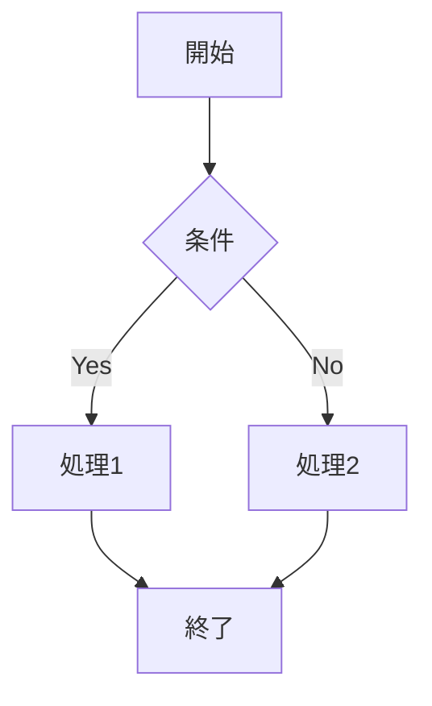

# 機能仕様

MarkDrive の各機能について詳しく説明します。

## Markdown レンダリング

### GitHub Flavored Markdown (GFM)

標準の Markdown 構文に加え、GitHub Flavored Markdown をサポートしています。

#### テーブル

```markdown
| 列1 | 列2 | 列3 |
|-----|-----|-----|
| A   | B   | C   |
| D   | E   | F   |
```

#### タスクリスト

```markdown
- [x] 完了したタスク
- [ ] 未完了のタスク
```

#### 打ち消し線

```markdown
~~打ち消し線~~
```

#### オートリンク

URL やメールアドレスは自動的にリンクになります。

### シンタックスハイライト

コードブロックは言語を指定することでシンタックスハイライトが適用されます。

````markdown
```javascript
const greeting = "Hello, World!";
console.log(greeting);
```
````

**対応言語例:**
- JavaScript / TypeScript
- Python
- Go
- Rust
- Java
- C / C++
- HTML / CSS
- JSON / YAML
- Markdown
- その他多数

### Mermaid ダイアグラム

コードブロックで `mermaid` を指定すると、ダイアグラムとしてレンダリングされます。

````markdown

````

**対応ダイアグラム:**
- フローチャート（flowchart）
- シーケンス図（sequenceDiagram）
- クラス図（classDiagram）
- 状態遷移図（stateDiagram）
- ER 図（erDiagram）
- ガントチャート（gantt）
- パイチャート（pie）
- その他

---

## 編集モード

### 概要

Markdown ファイルをブラウザ上で直接編集できます。ローカルファイルは File System Access API 対応ブラウザで直接上書き保存が可能です。

### CodeMirror 6 エディタ

Markdown の編集には CodeMirror 6 を採用しています。

**主な機能:**

- Markdown シンタックスハイライト（見出し、太字、リンク等を色分け表示）
- 行番号表示
- 自動行折り返し
- エディタ内検索（`Ctrl+F` / `⌘F`）
- 入力履歴の Undo / Redo
- テーマ連動（ダーク / ライトモードに自動追従）
- フォント設定連動（サイズ・書体がビューアと同じ設定を使用）

### 編集フロー

1. ビューア画面でセグメントコントロールの「Edit」を選択（またはキーボードショートカット `E`）
2. CodeMirror エディタで Markdown ソースを編集
3. `⌘S` / `Ctrl+S` で保存
4. 保存処理:
   - **ローカルファイル（File System Access API 対応ブラウザ）**: 元のファイルを直接上書き保存
   - **その他**: 新しいファイルとしてダウンロード

### 保存状態の表示

エディタフッターに以下の情報が表示されます:

| 表示 | 意味 |
|------|------|
| 行数・文字数 | 現在のドキュメント統計 |
| 未保存インジケーター（黄色ドット） | 未保存の変更あり |
| Saving... | 保存処理中 |
| Saved | 保存完了（3 秒間表示） |
| Error | 保存エラー |

### 注意事項

- 編集モードはすべてのファイル（Google Drive・ローカル）で使用可能です
- ローカルファイルの直接上書き保存には File System Access API 対応ブラウザ（Chrome, Edge 等）が必要です
- ページ離脱時に未保存の変更がある場合、確認ダイアログが表示されます

---

## Google Drive 連携

### 認証

Google OAuth 2.0 を使用した安全な認証を提供します。

- **スコープ**: `drive.readonly`（読み取り専用）
- **認証方式**: ポップアップウィンドウ
- **トークン保存**: localStorage（セッション間で維持、有効期限付き）
- **CSRF 対策**: OAuth `state` パラメータによる検証

### ファイル検索

- **検索対象**: Markdown ファイル（`.md`）のみ
- **検索範囲**: アクセス可能なすべての Google Drive ファイル
- **最小文字数**: 2文字以上
- **結果件数**: 最大20件

### キーボードショートカット

| ショートカット | 動作 |
|---------------|------|
| `⌘K` / `Ctrl+K` | 検索画面を開く |
| `E` | 編集モード切り替え（ビューア画面） |
| `F` | フルスクリーン切り替え（ビューア画面） |
| `⌘S` / `Ctrl+S` | 編集内容を保存（編集モード） |
| `Escape` | 検索画面を閉じる |

---

## ローカルファイル

### 対応形式

- `.md` ファイル
- `.markdown` ファイル
- `.txt` ファイル（Markdown として解釈）

### 読み込み方法

1. 「ローカルファイルを開く」ボタンをクリック
2. ファイル選択ダイアログからファイルを選択

### 編集と保存

File System Access API 対応ブラウザ（Chrome, Edge 等）では、ローカルファイルを開くときにファイルハンドルが保持されます。編集後の保存時に元のファイルを直接上書きできます。非対応ブラウザではダウンロードとして保存されます。

> **Note:** ファイル内容はブラウザ内で処理され、サーバーには送信されません。

---

## PDF 出力

### 機能

- Markdown のレンダリング結果を PDF として出力
- スタイル（テーマ）を維持
- コードブロックのシンタックスハイライトを維持

### 使用方法

1. Markdown ファイルを開く
2. ファイル名をタップ
3. 「PDF 出力」ボタンをクリック
4. PDF ファイルがダウンロードされます

### 設定

PDF のページサイズ: A4

---

## ファイル履歴

### 機能

- 最近開いたファイルを最大10件まで記録
- ファイルソース（Google Drive / ローカル）を表示
- 最終アクセス日時を表示

### ストレージ

- `localStorage` に保存
- ファイル内容は保存しない（ファイル ID と名前のみ）

### クリア

ホーム画面の「クリア」ボタンで履歴を削除できます。

---

## テーマ設定

### ダークモード / ライトモード / システム

3 つのテーマモードを選択できます:

| モード | 動作 |
|--------|------|
| ライト | 常にライトテーマを使用 |
| ダーク | 常にダークテーマを使用 |
| システム | OS のカラースキーム設定に追従（自動切り替え） |

- トグルボタンで切り替え
- システムモードでは OS の `prefers-color-scheme` メディアクエリを監視し、リアルタイムに切り替え
- 設定は `localStorage` に保存

### カラースキーム

**ダークモード:**
- 背景: 深いインディゴ系グレー
- アクセント: インディゴ (#6366f1)
- テキスト: 明るいグレー

**ライトモード:**
- 背景: ホワイト / ライトグレー
- アクセント: インディゴ (#6366f1)
- テキスト: ダークグレー

---

## フォント設定

### フォントサイズ

| 設定 | 倍率 |
|------|------|
| 小 (Small) | 0.9x |
| 中 (Medium) | 1.0x |
| 大 (Large) | 1.1x |

### フォントファミリー

| 設定 | フォントスタック |
|------|-----------------|
| システム | -apple-system, BlinkMacSystemFont, "Segoe UI", ... |
| 明朝体 (Serif) | Georgia, "Times New Roman", Times, serif |
| ゴシック体 (Sans-serif) | "Helvetica Neue", Helvetica, Arial, sans-serif |

---

## 多言語対応

### サポート言語

- 英語 (English)
- 日本語

### 切り替え方法

1. メニューを開く
2. 言語セクションで「English」または「日本語」を選択

### 翻訳範囲

- UI テキスト（ボタン、ラベル、メッセージ）
- エラーメッセージ
- プレースホルダー

> **Note:** Markdown コンテンツ自体は翻訳されません。

---

## フルスクリーンモード

### 機能

- ビューア画面で `F` キーまたはボタンで全画面表示に切り替え
- ヘッダーは自動的に非表示になり、タップで 3 秒間再表示
- Fullscreen API を使用（Web ブラウザ対応）
- `Escape` キーまたはヘッダーの閉じるボタンで解除

---

## PWA 対応

### ホーム画面に追加（iOS）

iOS Safari でアクセスした際に「ホーム画面に追加」バナーが表示されます。

- **対象**: iOS Safari のみ（既にスタンドアロンモードの場合は非表示）
- **非表示期間**: 閉じた後 7 日間は再表示されない
- **スタンドアロンモード**: ホーム画面から起動するとネイティブアプリのような表示

---

## アクセシビリティ

### キーボード操作

- すべての主要機能はキーボードで操作可能
- `⌘K` / `Ctrl+K` で検索
- `Escape` で閉じる

### レスポンシブデザイン

- モバイル、タブレット、デスクトップに対応
- 画面サイズに応じてレイアウトが調整されます
